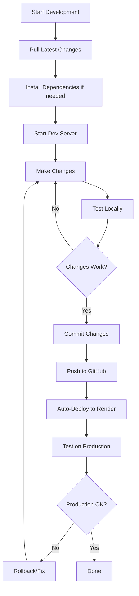
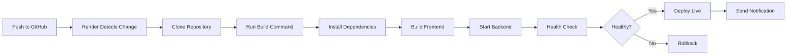

# 🔄 Chameleon Development Workflow

## 📋 Table of Contents
1. [Quick Start](#quick-start)
2. [Development Workflow](#development-workflow)
3. [Build & Deploy Workflow](#build--deploy-workflow)
4. [Git Workflow](#git-workflow)
5. [Testing Workflow](#testing-workflow)
6. [Troubleshooting Workflow](#troubleshooting-workflow)

---

## 🚀 Quick Start

### First Time Setup
```bash
# 1. Clone repository
git clone https://github.com/Harvhoax/Chameleon-cybersecurity-ml.git
cd Chameleon-cybersecurity-ml

# 2. Install all dependencies
npm run install:all

# 3. Configure environment
# Edit Backend/.env with your MongoDB URL and secrets

# 4. Start development
npm run start:integrated

# 5. Access app
# http://localhost:8000
```

---

## 💻 Development Workflow

### Daily Development Cycle



### Step-by-Step

#### 1. **Pull Latest Changes**
```bash
git pull origin main
```

#### 2. **Install Dependencies** (if package.json changed)
```bash
npm run install:all
```

#### 3. **Start Development Server**

**Option A: Integrated Mode (Recommended)**
```bash
npm run start:integrated
```
- Single port (8000)
- Production-like setup
- Backend serves frontend

**Option B: Separate Mode (For frontend hot reload)**
```bash
npm start
```
- Frontend: http://localhost:5173
- Backend: http://localhost:8000
- Faster frontend updates

#### 4. **Make Changes**

**Frontend Changes:**
- Edit files in `frontend/src/`
- Changes auto-reload (in separate mode)
- Rebuild needed (in integrated mode)

**Backend Changes:**
- Edit files in `Backend/`
- Server auto-reloads
- Check logs for errors

#### 5. **Test Locally**

**Test Frontend:**
- Open http://localhost:8000 (or 5173)
- Login: admin / chameleon2024
- Test all features

**Test Backend API:**
```bash
# Health check
curl http://localhost:8000/api/health

# Test attack submission
curl -X POST http://localhost:8000/api/trap/submit \
  -H "Content-Type: application/json" \
  -d '{"input_text":"SELECT * FROM users"}'
```

#### 6. **Commit Changes**
```bash
git add .
git commit -m "Description of changes"
```

#### 7. **Push to GitHub**
```bash
git push origin main
```

#### 8. **Auto-Deploy**
- Render automatically deploys on push
- Wait ~2-3 minutes
- Check Render dashboard for status

#### 9. **Test Production**
```bash
curl https://your-app.onrender.com/api/health
```

---

## 🏗️ Build & Deploy Workflow

### Local Build
```bash
# Build frontend
npm run build

# Output: frontend/dist/
```

### Production Build (Render)
```bash
# Render runs automatically:
npm run deploy:build

# This does:
# 1. npm install (root)
# 2. cd frontend && npm install --legacy-peer-deps
# 3. npm run build
# 4. cd Backend && pip install -r requirements.txt
```

### Manual Deploy to Render
```bash
# 1. Commit all changes
git add .
git commit -m "Deploy to production"

# 2. Push to GitHub
git push origin main

# 3. Render auto-deploys
# Monitor at: https://dashboard.render.com
```

### Deploy Checklist
- [ ] All changes committed
- [ ] Tests passing locally
- [ ] Environment variables set in Render
- [ ] MongoDB connection working
- [ ] Build command: `npm run deploy:build`
- [ ] Start command: `cd Backend && uvicorn main:app --host 0.0.0.0 --port $PORT`

---

## 🌿 Git Workflow

### Branch Strategy

```
main (production)
  ↓
feature/new-feature (development)
  ↓
fix/bug-fix (hotfix)
```

### Creating a Feature

```bash
# 1. Create feature branch
git checkout -b feature/attack-analytics

# 2. Make changes
# ... edit files ...

# 3. Commit frequently
git add .
git commit -m "Add attack analytics dashboard"

# 4. Push feature branch
git push origin feature/attack-analytics

# 5. Create Pull Request on GitHub

# 6. After review, merge to main
git checkout main
git merge feature/attack-analytics
git push origin main
```

### Hotfix Workflow

```bash
# 1. Create hotfix branch from main
git checkout main
git checkout -b fix/timestamp-bug

# 2. Fix the bug
# ... edit files ...

# 3. Commit fix
git add .
git commit -m "Fix timestamp display bug"

# 4. Merge back to main
git checkout main
git merge fix/timestamp-bug
git push origin main

# 5. Delete hotfix branch
git branch -d fix/timestamp-bug
```

### Commit Message Convention

```bash
# Format: <type>: <description>

# Types:
feat: Add new feature
fix: Fix a bug
docs: Update documentation
style: Code style changes (formatting)
refactor: Code refactoring
test: Add or update tests
chore: Maintenance tasks

# Examples:
git commit -m "feat: Add threat intelligence feed"
git commit -m "fix: Resolve timestamp sync issue"
git commit -m "docs: Update deployment guide"
```

---

## 🧪 Testing Workflow

### Manual Testing

#### Frontend Testing
```bash
# 1. Start app
npm run start:integrated

# 2. Test each page
- Login page
- Dashboard
- Attack logs
- Analytics
- Threat intelligence
- Attack globe

# 3. Test features
- Submit attack
- View logs
- Generate report
- Check stats
```

#### Backend API Testing
```bash
# Health check
curl http://localhost:8000/api/health

# Login
curl -X POST http://localhost:8000/api/auth/login \
  -H "Content-Type: application/json" \
  -d '{"username":"admin","password":"chameleon2024"}'

# Submit attack
curl -X POST http://localhost:8000/api/trap/submit \
  -H "Content-Type: application/json" \
  -d '{"input_text":"<script>alert(1)</script>"}'

# Get stats
curl http://localhost:8000/api/dashboard/stats \
  -H "Authorization: Bearer YOUR_TOKEN"

# Get logs
curl http://localhost:8000/api/dashboard/logs \
  -H "Authorization: Bearer YOUR_TOKEN"
```

### Production Testing

```bash
# Replace localhost with your Render URL
curl https://your-app.onrender.com/api/health

# Test frontend
# Open in browser: https://your-app.onrender.com
```

---

## 🐛 Troubleshooting Workflow

### Issue: Build Fails

```bash
# 1. Check error message
npm run build

# 2. Common fixes:
# - Clear node_modules
rm -rf node_modules frontend/node_modules
npm run install:all

# - Clear build cache
rm -rf frontend/dist

# - Check Node/Python versions
node --version  # Should be 22.x
python --version  # Should be 3.12.x
```

### Issue: App Won't Start Locally

```bash
# 1. Check if ports are in use
# Windows:
netstat -ano | findstr :8000
netstat -ano | findstr :5173

# Linux/Mac:
lsof -i :8000
lsof -i :5173

# 2. Kill processes if needed
# Windows:
taskkill /PID <PID> /F

# Linux/Mac:
kill -9 <PID>

# 3. Restart app
npm run start:integrated
```

### Issue: Render Deploy Fails

```bash
# 1. Check Render logs
# Go to: https://dashboard.render.com
# Click your service → Logs

# 2. Common issues:
# - Python version: Check runtime.txt
# - Dependencies: Check requirements.txt
# - Build command: Should be "npm run deploy:build"
# - Start command: Should be "cd Backend && uvicorn main:app --host 0.0.0.0 --port $PORT"

# 3. Clear build cache
# Render Dashboard → Settings → Clear build cache
```

### Issue: Frontend Not Loading

```bash
# 1. Check if frontend was built
ls frontend/dist/

# 2. Rebuild frontend
npm run build

# 3. Check backend is serving frontend
# Look for in logs:
# "✅ Frontend dist folder found at: ..."

# 4. Test static files
curl http://localhost:8000/assets/index-*.js
```

### Issue: Database Connection Failed

```bash
# 1. Check MongoDB URL
# Backend/.env should have:
MONGODB_URL=mongodb+srv://...

# 2. Test connection
# Check backend logs for:
# "✅ Connected to MongoDB successfully"

# 3. Verify MongoDB Atlas
# - IP whitelist includes 0.0.0.0/0
# - Database user has correct permissions
# - Connection string is correct
```

---

## 📊 Complete Development Cycle

### Morning Routine
```bash
# 1. Pull latest changes
git pull origin main

# 2. Check for updates
npm run install:all

# 3. Start development
npm run start:integrated

# 4. Check everything works
curl http://localhost:8000/api/health
```

### Making Changes
```bash
# 1. Create feature branch (optional)
git checkout -b feature/my-feature

# 2. Make changes
# Edit files...

# 3. Test locally
npm run start:integrated

# 4. Commit changes
git add .
git commit -m "feat: Add my feature"

# 5. Push changes
git push origin feature/my-feature
# or
git push origin main
```

### End of Day
```bash
# 1. Commit all work
git add .
git commit -m "WIP: End of day commit"

# 2. Push to backup
git push origin main

# 3. Stop servers
# Press Ctrl+C in terminal
```

---

## 🔄 CI/CD Workflow (Render)

### Automatic Deployment



### Deployment Steps (Automatic)

1. **Trigger**: Push to `main` branch
2. **Build**: `npm run deploy:build`
3. **Start**: `cd Backend && uvicorn main:app --host 0.0.0.0 --port $PORT`
4. **Health Check**: Render pings `/api/health`
5. **Go Live**: Traffic routed to new deployment
6. **Notification**: Email/Slack notification (if configured)

---

## 📝 Quick Reference

### Essential Commands

| Task | Command |
|------|---------|
| **Install all** | `npm run install:all` |
| **Start dev (integrated)** | `npm run start:integrated` |
| **Start dev (separate)** | `npm start` |
| **Build** | `npm run build` |
| **Deploy build** | `npm run deploy:build` |
| **Test health** | `curl http://localhost:8000/api/health` |

### File Locations

| Component | Location |
|-----------|----------|
| **Frontend source** | `frontend/src/` |
| **Backend source** | `Backend/` |
| **Frontend build** | `frontend/dist/` |
| **Environment vars** | `Backend/.env`, `frontend/.env` |
| **Dependencies** | `package.json`, `Backend/requirements.txt` |
| **Config** | `render.yaml`, `runtime.txt` |

### Important URLs

| Service | URL |
|---------|-----|
| **Local frontend** | http://localhost:8000 |
| **Local backend** | http://localhost:8000/api |
| **Local API docs** | http://localhost:8000/docs |
| **Production** | https://your-app.onrender.com |
| **Render dashboard** | https://dashboard.render.com |
| **GitHub repo** | https://github.com/Harvhoax/Chameleon-cybersecurity-ml |

---

## ✅ Best Practices

### Development
- ✅ Pull before starting work
- ✅ Commit frequently with clear messages
- ✅ Test locally before pushing
- ✅ Use feature branches for big changes
- ✅ Keep dependencies updated

### Deployment
- ✅ Test in production after deploy
- ✅ Monitor Render logs
- ✅ Keep environment variables secure
- ✅ Use semantic versioning
- ✅ Document breaking changes

### Security
- ✅ Never commit secrets to Git
- ✅ Use environment variables
- ✅ Change default passwords
- ✅ Keep dependencies updated
- ✅ Review security alerts

---

**Status:** ✅ Complete Workflow Guide
**Last Updated:** 2025-11-23
**Version:** 1.0.0
