# 🔄 Chameleon Workflow Flowcharts

## 📊 Complete Development Workflow

```mermaid
flowchart TD
    Start([Start Development]) --> Pull[Pull Latest Changes<br/>git pull origin main]
    Pull --> CheckDeps{Dependencies<br/>Changed?}
    CheckDeps -->|Yes| InstallDeps[Install Dependencies<br/>npm run install:all]
    CheckDeps -->|No| StartDev
    InstallDeps --> StartDev[Start Dev Server<br/>npm run start:integrated]
    
    StartDev --> DevChoice{Development<br/>Mode?}
    DevChoice -->|Integrated| Integrated[Single Port 8000<br/>Production-like]
    DevChoice -->|Separate| Separate[Frontend: 5173<br/>Backend: 8000]
    
    Integrated --> MakeChanges
    Separate --> MakeChanges[Make Code Changes]
    
    MakeChanges --> TestLocal[Test Locally<br/>http://localhost:8000]
    TestLocal --> WorksLocal{Works<br/>Locally?}
    
    WorksLocal -->|No| Debug[Debug Issues<br/>Check Logs]
    Debug --> MakeChanges
    
    WorksLocal -->|Yes| Commit[Commit Changes<br/>git add .<br/>git commit -m "..."]
    Commit --> Push[Push to GitHub<br/>git push origin main]
    
    Push --> RenderDetect[Render Detects Push]
    RenderDetect --> RenderBuild[Render Builds<br/>npm run deploy:build]
    
    RenderBuild --> BuildSuccess{Build<br/>Success?}
    BuildSuccess -->|No| CheckLogs[Check Render Logs<br/>Fix Issues]
    CheckLogs --> MakeChanges
    
    BuildSuccess -->|Yes| Deploy[Deploy to Production]
    Deploy --> HealthCheck[Health Check<br/>/api/health]
    
    HealthCheck --> ProdWorks{Production<br/>Working?}
    ProdWorks -->|No| Rollback[Rollback or Hotfix]
    Rollback --> MakeChanges
    
    ProdWorks -->|Yes| Monitor[Monitor Application]
    Monitor --> End([Development Cycle Complete])
    
    style Start fill:#4CAF50,color:#fff
    style End fill:#4CAF50,color:#fff
    style WorksLocal fill:#2196F3,color:#fff
    style BuildSuccess fill:#2196F3,color:#fff
    style ProdWorks fill:#2196F3,color:#fff
    style Debug fill:#FF9800,color:#fff
    style CheckLogs fill:#FF9800,color:#fff
    style Rollback fill:#F44336,color:#fff
```

---

## 🚀 Deployment Workflow

```mermaid
flowchart TD
    Start([Code Ready]) --> LocalTest[Test Locally<br/>npm run start:integrated]
    LocalTest --> TestPass{All Tests<br/>Pass?}
    
    TestPass -->|No| Fix[Fix Issues]
    Fix --> LocalTest
    
    TestPass -->|Yes| Commit[Commit Changes<br/>git add .<br/>git commit]
    Commit --> Push[Push to GitHub<br/>git push origin main]
    
    Push --> Trigger[Render Webhook Triggered]
    Trigger --> Clone[Clone Repository]
    Clone --> DetectConfig[Detect Configuration<br/>render.yaml, runtime.txt]
    
    DetectConfig --> SetEnv[Set Environment<br/>Python 3.12.0<br/>Node.js 22.16.0]
    SetEnv --> BuildCmd[Run Build Command<br/>npm run deploy:build]
    
    BuildCmd --> InstallRoot[Install Root Dependencies<br/>npm install]
    InstallRoot --> InstallFE[Install Frontend Deps<br/>cd frontend && npm install]
    InstallFE --> BuildFE[Build Frontend<br/>npm run build]
    BuildFE --> InstallBE[Install Backend Deps<br/>pip install -r requirements.txt]
    
    InstallBE --> BuildSuccess{Build<br/>Success?}
    BuildSuccess -->|No| BuildFail[Build Failed<br/>Check Logs]
    BuildFail --> Notify1[Notify Developer]
    Notify1 --> End1([Fix and Retry])
    
    BuildSuccess -->|Yes| StartCmd[Run Start Command<br/>uvicorn main:app]
    StartCmd --> ServerStart[Server Starting...]
    ServerStart --> HealthCheck[Health Check<br/>GET /api/health]
    
    HealthCheck --> HealthPass{Health Check<br/>Pass?}
    HealthPass -->|No| StartFail[Startup Failed]
    StartFail --> Notify2[Notify Developer]
    Notify2 --> End2([Fix and Retry])
    
    HealthPass -->|Yes| RouteTraffic[Route Traffic to New Deploy]
    RouteTraffic --> Live[🎉 Application Live!]
    Live --> Monitor[Monitor Logs & Metrics]
    Monitor --> End3([Deployment Complete])
    
    style Start fill:#4CAF50,color:#fff
    style End3 fill:#4CAF50,color:#fff
    style Live fill:#4CAF50,color:#fff
    style BuildSuccess fill:#2196F3,color:#fff
    style HealthPass fill:#2196F3,color:#fff
    style BuildFail fill:#F44336,color:#fff
    style StartFail fill:#F44336,color:#fff
```



---

## 🌿 Git Workflow

```mermaid
flowchart TD
    Start([Start Work]) --> CheckBranch{On Main<br/>Branch?}
    
    CheckBranch -->|No| SwitchMain[git checkout main]
    CheckBranch -->|Yes| PullMain
    SwitchMain --> PullMain[Pull Latest<br/>git pull origin main]
    
    PullMain --> FeatureType{Feature<br/>Type?}
    
    FeatureType -->|Small Change| DirectMain[Work on Main]
    FeatureType -->|Large Feature| CreateBranch[Create Feature Branch<br/>git checkout -b feature/name]
    FeatureType -->|Bug Fix| CreateHotfix[Create Hotfix Branch<br/>git checkout -b fix/name]
    
    DirectMain --> MakeChanges
    CreateBranch --> MakeChanges
    CreateHotfix --> MakeChanges[Make Code Changes]
    
    MakeChanges --> Test[Test Changes]
    Test --> TestPass{Tests<br/>Pass?}
    
    TestPass -->|No| MakeChanges
    TestPass -->|Yes| Stage[Stage Changes<br/>git add .]
    
    Stage --> Commit[Commit Changes<br/>git commit -m "type: description"]
    Commit --> OnMain{On Main<br/>Branch?}
    
    OnMain -->|Yes| PushMain[Push to Main<br/>git push origin main]
    OnMain -->|No| PushBranch[Push Branch<br/>git push origin branch-name]
    
    PushBranch --> CreatePR[Create Pull Request<br/>on GitHub]
    CreatePR --> Review[Code Review]
    Review --> Approved{PR<br/>Approved?}
    
    Approved -->|No| RequestChanges[Request Changes]
    RequestChanges --> MakeChanges
    
    Approved -->|Yes| MergePR[Merge to Main]
    MergePR --> DeleteBranch[Delete Feature Branch<br/>git branch -d branch-name]
    DeleteBranch --> AutoDeploy
    
    PushMain --> AutoDeploy[Auto-Deploy to Render]
    AutoDeploy --> End([Workflow Complete])
    
    style Start fill:#4CAF50,color:#fff
    style End fill:#4CAF50,color:#fff
    style TestPass fill:#2196F3,color:#fff
    style Approved fill:#2196F3,color:#fff
```

---

## 🧪 Testing Workflow


---

## 🐛 Troubleshooting Workflow

```mermaid
flowchart TD
    Start([Issue Detected]) --> IssueType{Issue<br/>Type?}
    
    IssueType -->|Build Fails| BuildIssue
    IssueType -->|App Won't Start| StartIssue
    IssueType -->|Deploy Fails| DeployIssue
    IssueType -->|Runtime Error| RuntimeIssue
    
    BuildIssue[Build Failure] --> CheckBuildLogs[Check Build Logs]
    CheckBuildLogs --> BuildCause{Root<br/>Cause?}
    
    BuildCause -->|Dependencies| FixDeps[Clear & Reinstall<br/>rm -rf node_modules<br/>npm run install:all]
    BuildCause -->|Syntax Error| FixSyntax[Fix Code Syntax]
    BuildCause -->|Missing Files| FixFiles[Add Missing Files]
    
    FixDeps --> RebuildTest
    FixSyntax --> RebuildTest
    FixFiles --> RebuildTest[Test Build<br/>npm run build]
    
    StartIssue[Startup Failure] --> CheckPort[Check Port Usage<br/>netstat -ano | findstr :8000]
    CheckPort --> PortBusy{Port<br/>In Use?}
    
    PortBusy -->|Yes| KillProcess[Kill Process<br/>taskkill /PID xxx /F]
    PortBusy -->|No| CheckEnv[Check Environment<br/>Variables]
    
    KillProcess --> RestartApp
    CheckEnv --> EnvOk{Env Vars<br/>Set?}
    EnvOk -->|No| SetEnv[Set Environment Variables]
    EnvOk -->|Yes| CheckDb[Check Database Connection]
    
    SetEnv --> RestartApp
    CheckDb --> DbOk{DB<br/>Connected?}
    DbOk -->|No| FixDb[Fix MongoDB Connection]
    DbOk -->|Yes| RestartApp[Restart Application<br/>npm run start:integrated]
    
    FixDb --> RestartApp
    
    DeployIssue[Deploy Failure] --> CheckRenderLogs[Check Render Logs]
    CheckRenderLogs --> DeployCause{Root<br/>Cause?}
    
    DeployCause -->|Build Command| FixBuildCmd[Update Build Command<br/>npm run deploy:build]
    DeployCause -->|Python Version| FixPython[Check runtime.txt<br/>python-3.12.0]
    DeployCause -->|Dependencies| FixReqs[Update requirements.txt]
    DeployCause -->|Timeout| OptimizeBuild[Optimize Build Process]
    
    FixBuildCmd --> ClearCache
    FixPython --> ClearCache
    FixReqs --> ClearCache
    OptimizeBuild --> ClearCache[Clear Build Cache<br/>Render Dashboard]
    
    ClearCache --> Redeploy[Redeploy<br/>git push origin main]
    
    RuntimeIssue[Runtime Error] --> CheckAppLogs[Check Application Logs]
    CheckAppLogs --> RuntimeCause{Error<br/>Type?}
    
    RuntimeCause -->|TypeError| FixType[Fix Type Error<br/>Check function calls]
    RuntimeCause -->|ImportError| FixImport[Fix Import Error<br/>Check dependencies]
    RuntimeCause -->|DatabaseError| FixDbError[Fix Database Error<br/>Check connection]
    RuntimeCause -->|APIError| FixApi[Fix API Error<br/>Check endpoints]
    
    FixType --> TestFix
    FixImport --> TestFix
    FixDbError --> TestFix
    FixApi --> TestFix[Test Fix Locally]
    
    RebuildTest --> BuildWorks{Build<br/>Success?}
    RestartApp --> AppWorks{App<br/>Started?}
    Redeploy --> DeployWorks{Deploy<br/>Success?}
    TestFix --> FixWorks{Fix<br/>Works?}
    
    BuildWorks -->|No| BuildIssue
    BuildWorks -->|Yes| Resolved
    
    AppWorks -->|No| StartIssue
    AppWorks -->|Yes| Resolved
    
    DeployWorks -->|No| DeployIssue
    DeployWorks -->|Yes| Resolved
    
    FixWorks -->|No| RuntimeIssue
    FixWorks -->|Yes| Resolved[Issue Resolved]
    
    Resolved --> Document[Document Solution]
    Document --> End([Troubleshooting Complete])
    
    style Start fill:#F44336,color:#fff
    style End fill:#4CAF50,color:#fff
    style Resolved fill:#4CAF50,color:#fff
    style BuildWorks fill:#2196F3,color:#fff
    style AppWorks fill:#2196F3,color:#fff
    style DeployWorks fill:#2196F3,color:#fff
    style FixWorks fill:#2196F3,color:#fff
```

---

## 🔄 CI/CD Pipeline


---

## 📱 User Request Flow


---

## 🎯 Quick Reference

### Development Cycle
```
Pull → Install → Develop → Test → Commit → Push → Deploy → Monitor
```

### Build Process
```
Install Root → Install Frontend → Build Frontend → Install Backend → Ready
```

### Deployment Flow
```
Push → Trigger → Build → Test → Deploy → Live
```

### Troubleshooting
```
Detect Issue → Check Logs → Identify Cause → Apply Fix → Test → Resolve
```

---

**Status:** ✅ Complete Flowchart Guide
**Last Updated:** 2025-11-23
**Format:** Mermaid Diagrams
